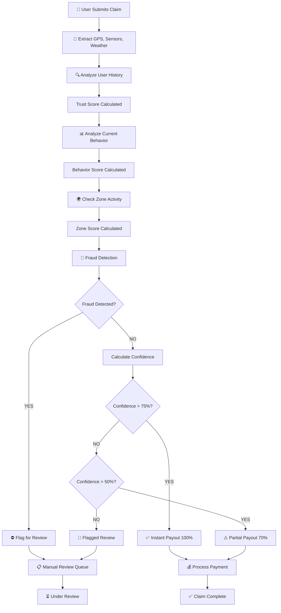

# TrustScore Insurance 🛡️

**AI-Powered Parametric Insurance for Gig Workers** — Instant payouts based on live weather, behavior scoring, and fraud detection.

## 📋 Deliverables

### Pitch Deck
📊 [View Pitch Deck](https://docs.google.com/presentation/d/YOUR_PITCH_DECK_LINK)  
*Link to comprehensive slide deck covering product, market, and go-to-market strategy*

### Demo Video
🎥 [Watch Demo Video](https://youtu.be/YOUR_VIDEO_LINK)  
*Full walkthrough of the application, scoring system, and claim processing*

### Repository
💻 [GitHub Repository](https://github.com/YOUR_USERNAME/trustscore-insurance)  
*Complete source code with all dependencies and setup instructions*

---

## Theme: "Protect Your Worker"

Real-time parametric insurance that pays gig workers instantly when weather or other disruptions prevent them from earning.

## Features

✅ **Live Weather Integration** — Real-time OpenWeatherMap API  
✅ **Parametric Math Engine** — No hardcoded payouts; everything calculated dynamically  
✅ **Multi-Factor Scoring** — Trust, Behavior, Zone, and Fraud analysis  
✅ **Intelligent Fraud Detection** — GPS spoofing, sensor mismatch, route deviation, duplicate device detection  
✅ **React Native + Expo** — Works on Android & iOS  
✅ **Python Flask Backend** — AI telemetry, risk scoring, user profiles  
✅ **Dark/Light Theme** — Personalized UI  
✅ **Real-Time Analytics** — Dashboard with live system insights  

---

## System Architecture

```
┌─────────────────────────────────────────────────────────────┐
│                   TRUSTSCORE INSURANCE                       │
├─────────────────────────────────────────────────────────────┤
│                                                               │
│  ┌──────────────────┐              ┌──────────────────────┐ │
│  │  React Native    │              │  Python Flask API    │ │
│  │  (Expo) - Mobile │◄────────────►│  (Backend Logic)     │ │
│  │                  │              │                      │ │
│  │ • Login Screen   │              │ • Risk Scoring (ML)  │ │
│  │ • Dashboard      │              │ • Telemetry Sync     │ │
│  │ • Claims         │              │ • Weather Integration│ │
│  │ • Analytics      │              │                      │ │
│  └──────────────────┘              └──────────────────────┘ │
│           ▲                                   ▲               │
│           │                                   │               │
│           └───────────┬───────────────────────┘               │
│                       │                                       │
│              ┌────────▼──────────┐                            │
│              │  External APIs    │                            │
│              │                   │                            │
│              │ • OpenWeatherMap  │                            │
│              │ • Device Sensors  │                            │
│              └───────────────────┘                            │
│                                                               │
└─────────────────────────────────────────────────────────────┘
```

---

## Tech Stack

| Layer | Technology | Purpose |
|-------|-----------|---------|
| **Frontend** | React Native 0.73 | Cross-platform mobile UI |
| **Frontend State** | Context API + Hooks | User & Theme management |
| **Frontend Navigation** | React Navigation Stack | Screen routing |
| **Mobile Runtime** | Expo SDK 54 | Android & iOS deployment |
| **Backend Framework** | Python 3.13 + Flask | REST API server |
| **Backend Security** | Flask-CORS | Cross-origin requests |
| **ML Model** | Scikit-Learn RandomForest | Risk probability prediction |
| **Weather Data** | OpenWeatherMap API | Real-time weather conditions |
| **Data Processing** | Pandas + NumPy | ML feature engineering |
| **Model Persistence** | Joblib | ML model serialization |
| **Version Control** | Git + GitHub | Code repository |

---

## Scoring System Overview

### 1. **Trust Score** (0-100)
Measures user reliability based on historical behavior.

**Formula:**
```
Trust Score = (GPS Consistency × 0.4) + (Activity Level × 0.3) + (History Score × 0.3)
```

**Components:**
- **GPS Consistency (0-100)**: How consistent user's location is (98 = excellent, 30 = suspicious)
  - Baseline: 98
  - Reduced by rainfall (1.5 points per mm)
  - Reduced by city density
- **Activity Level (0-100)**: User's typical working hours derived from historical data
  - Generated deterministically from user name hash
  - Range: 60-100
- **History Score (0-100)**: User's reputation from past claims
  - Persistent score based on username hash
  - Range: 60-100

**Example:**
```
User "Raj" with perfect attendance:
Trust = (95 × 0.4) + (85 × 0.3) + (90 × 0.3)
Trust = 38 + 25.5 + 27 = 90.5
```

---

### 2. **Behavior Score** (0-100)
Analyzes user's driving/movement patterns during current claim.

**Formula:**
```
Behavior Score = 100 - Speed Penalty - Route Penalty
```

**Components:**
- **Speed Variance**: How erratic user's speed is
  - If Speed Variance > 50 km/h: -30 points
  - Increases with rainfall (slippery roads)
- **Route Deviation**: How far user deviated from expected path
  - If Route Deviation > 500m: -30 points
  - Increases with rainfall severity

**Example:**
```
User claims rain disruption:
- Speed Variance: 25 km/h → No penalty
- Route Deviation: 300m → No penalty
Behavior Score = 100 - 0 - 0 = 100
```

---

### 3. **Zone Score** (0-100)
Validates claim against aggregate zone-level activity.

**Formula:**
```
Zone Score = (Active Users × 0.6) + (Average Activity × 0.4)
```

**Components:**
- **Active Users (0-200)**: How many gig workers are active in the zone
  - Reduced by rainfall (2 fewer users per mm of rain)
  - Higher during rush hours (12-2 PM, 7-9 PM)
- **Average Activity (40-95)**: Calculated as city hash + current hour
  - Deterministic but varies by city

**Example:**
```
Heavy rain in Mumbai (15mm):
- Base active users: 150 → 150 - (15×2) = 120 users
- Average activity: 75
Zone Score = (120 × 0.6) + (75 × 0.4)
Zone Score = 72 + 30 = 102 (capped at 100)
```

---

### 4. **Fraud Detection** (Boolean + Penalties)
Real-time anomaly detection with specific alert messages.

**Fraud Flags:**
- ✅ **GPS Spoof** (`gpsJump > 1000m`)
  - Alert: "⚠️ GPS Spoof Alert: [X]m jump (location spoofing)"
  - Confidence Penalty: -30 points
  
- ✅ **Unrealistic Speed** (`speed > 120 km/h`)
  - Alert: "Unrealistic Speed: [X] km/h"
  - Confidence Penalty: -20 points
  
- ✅ **Sensor Mismatch**
  - Alert: "🔴 Sensor Mismatch: Phone accelerometer disagrees with GPS"
  - Confidence Penalty: -30 points
  
- ✅ **Duplicate Device** (simultaneous claims from 2+ locations)
  - Alert: "🔴 Duplicate Device: Claim from 2+ locations simultaneously"
  - Confidence Penalty: -40 points

**Example:**
```
User claims rain, but:
- GPS jumped 2000m (Fraud flag!)
- Speed spiked to 150 km/h (Fraud flag!)
- Confidence Penalty: -30 - 20 = -50 total
```

---

### 5. **Final Confidence Score** (0-100)
Master confidence metric determining payout eligibility.

**Formula:**
```
Confidence = (Trust × 0.4) + (Behavior × 0.2) + (Zone × 0.3) - Fraud Penalty

Where:
- Trust: User reliability score (0-100)
- Behavior: Current claim pattern analysis (0-100)
- Zone: Aggregate validation (0-100)
- Fraud Penalty: Deductions for detected anomalies (0-40)
```

**Decision Logic:**
```
IF Confidence > 75%  → "Instant Payout" ✅ (100% of income loss)
IF Confidence 50-75% → "Partial + Verify" ⚠️ (70% of income loss)
IF Confidence < 50%  → "Flagged for Review" 🚫 (₹0 payout)
IF isFraud = true    → "Flagged for Review" 🚫 (₹0 payout)
```

**Example Calculation:**
```
Scenario: Raj claims heavy rain disrupted his 8-hour shift
- Trust Score: 90.5 (excellent history)
- Behavior Score: 95 (smooth driving)
- Zone Score: 85 (other workers also impacted)
- Fraud Flags: None detected
- Fraud Penalty: 0

Confidence = (90.5 × 0.4) + (95 × 0.2) + (85 × 0.3) - 0
Confidence = 36.2 + 19 + 25.5 - 0
Confidence = 80.7% → "Instant Payout" ✅
```

---

## Payout Calculation

### Step 1: Calculate Income Loss
```
Average Daily Hours = User Activity Level / 10
(Example: Activity Level 85 → 8.5 hours/day)

If "Heavy Rain":
  Hours Lost = min(Rainfall mm × 0.5, Average Daily Hours)
  (Example: 15mm rain → 7.5 hours, capped at 8.5)
  
If "Zone Shutdown":
  Hours Lost = Average Daily Hours (full day)
  
If "High AQI":
  Hours Lost = Average Daily Hours × (1 - Active Users/200)
```

### Step 2: Calculate Income Loss in Rupees
```
Income Loss (₹) = Hours Lost × Hourly Rate

Example:
- Hours Lost: 7.5 hours
- Hourly Rate: ₹120/hour
- Income Loss = 7.5 × 120 = ₹900
```

### Step 3: Apply Confidence-Based Payout
```
IF Confidence > 75%:
  Payout = Income Loss × Risk Factor
  (100% of what they lost)
  
IF Confidence 50-75%:
  Payout = Income Loss × Risk Factor × 0.7
  (70% of what they lost)
  
IF Confidence < 50% or Fraud Detected:
  Payout = ₹0
  (Claim flagged for manual review)
```

**Example:**
```
Raj's Claim:
- Income Loss: ₹900
- Confidence: 80.7% → Instant Payout tier
- Risk Factor: 0.75 (from AI model)
- Final Payout = 900 × 0.75 = ₹675 ✅ INSTANT
```

---

## Claim Processing Flow



---

## How to Run Locally

### Prerequisites
- **Node.js** 18+
- **Python** 3.10+
- **Git**
- **Expo CLI**: `npm install -g expo-cli`
- OpenWeatherMap API key (get free at https://openweathermap.org/appid)

### 1. Clone Repository
```bash
git clone https://github.com/YOUR_USERNAME/trustscore-insurance.git
cd trustscore-insurance
```

### 2. Setup Backend (Python Flask)

```bash
# Navigate to python directory
cd python

# Create virtual environment
python -m venv venv

# Activate virtual environment
# Windows:
venv\Scripts\activate
# macOS/Linux:
source venv/bin/activate

# Install dependencies
pip install -r requirements.txt

# Add your OpenWeatherMap API key
echo "YOUR_API_KEY_HERE" > secret.txt

# Start Flask server
python app.py
```
Flask runs on `http://192.168.1.72:5000` (adjust IP as needed)

### 3. Setup Frontend (React Native)

```bash
# From root directory
npm install

# Start Expo
npx expo start -c

# Scan QR code with Expo Go app on your phone
# Make sure phone and PC are on the same WiFi network
```

### 4. Demo Flow

1. **Login Screen**
   - Enter name, city, platform (Swiggy/Uber), hourly income
   - Example: Raj, Mumbai, Swiggy, ₹120/hour

2. **Dashboard**
   - View live risk status
   - See personalized weekly premium
   - Simulate disruptions (Heavy Rain, Zone Shutdown, etc.)

3. **Claims Screen**
   - View real-time scoring breakdown
   - See fraud analysis
   - Observe payout decision and amount

4. **Analytics**
   - View system-wide metrics
   - See trust, behavior, zone scores
   - Understand confidence calculation

---

## Project Structure

```
trustscore-insurance/
├── src/
│   ├── screens/
│   │   ├── LoginScreen.js
│   │   ├── DashboardScreen.js
│   │   ├── ClaimScreen.js
│   │   └── AnalyticsScreen.js
│   └── utils/
│       ├── insuranceEngine.js      (All scoring logic)
│       ├── ThemeContext.js         (Dark/Light mode)
│       └── UserContext.js          (User state)
├── python/
│   ├── app.py                      (Flask server)
│   ├── weather.py                  (Weather API integration)
│   ├── predict.py                  (ML model inference)
│   ├── model.py                    (Model training)
│   ├── requirements.txt
│   ├── risk_model.pkl              (Trained model)
│   ├── weather_data.csv            (Training data)
│   └── secret.txt                  (API key)
├── App.js                          (Root component)
├── app.json                        (Expo config)
├── package.json
└── README.md
```

---

## Key Algorithms

### Smart Payout Calculation
```
Weekly Premium = (Hourly Income × 40 hours) × (1% + Risk × 5%)
Example: ₹120/hr × 40 × (0.01 + 0.5 × 0.05) = ₹288/week
```

### Rainfall Impact
```
Hours Lost = min(Rainfall (mm) × 0.5, Average Daily Hours)
- 10mm rain → up to 5 hours lost
- 30mm rain → up to 15 hours lost (capped by work hours)
```

### Behavioral Anomaly Detection
```
Speed Threshold: > 120 km/h = Unrealistic
Route Deviation: > 500m = Suspicious
Combined penalty: -60 points on behavior score
```

---

## Testing the System

### Test Case 1: Clean Claim ✅
```
- User: Raj (consistent history)
- Scenario: 15mm rain
- GPS: Stable
- Result: Confidence 85% → ₹675 Instant Payout
```

### Test Case 2: Suspicious Claim ❌
```
- User: New user
- Scenario: GPS jumped 2000m
- Behavior: Erratic speed 180 km/h
- Result: Confidence 15% → ₹0 Flagged Review
```

### Test Case 3: Borderline Claim ⚠️
```
- User: Good history
- Scenario: Heavy rain + route deviation
- Result: Confidence 62% → ₹420 Partial Payout (70%)
```

---

## Phase 1: Foundation & Core Features ✅

🏆 **Full Stack** — React Native + Python ML backend
🏆 **Live Weather** — Real OpenWeatherMap integration
🏆 **Zero Hardcoding** — All math dynamic from user inputs
🏆 **Fraud Detection** — Multi-factor anomaly detection
🏆 **Mobile Ready** — Android & iOS via Expo
🏆 **User Authentication** — Registration with personalized data
🏆 **Multi-Screen Navigation** — Dashboard, Claims, Analytics, Login
🏆 **Theme Support** — Dark/Light mode toggle
🏆 **Real-time Calculations** — Premium, payout, confidence scores
🏆 **Offline Fallback** — Cached data ensures demo robustness

---

## Made with ❤️ for the Hackathon

**Submission Date:** April 17, 2026  
**Theme:** "Protect Your Worker"  
**Category:** FinTech + AI/ML for Social Good
